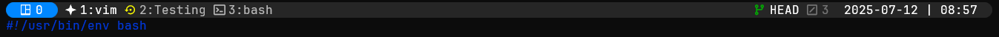

# Simple Dev Tmux

A simple Tmux theme developed to help development in the terminal.

## Requirements

This theme has the following hard requirements:

- Any patched [Nerd Fonts] (v3 or higher)
- Bash 4.2 or newer

The following are recommended for full support of all widgets and features:

- [bc] (git widget)
- [jq], [gh], [glab] (wbgit widget)

## Installation using TPM

In your `tmux.conf`:

```bash
set -g @plugin "emang7/simple-dev-tmux"
```

## Configuration

### Themes

Use following option to change theme preference:

```bash
set -g @simple-dev-tmux_theme default  # default or etc.
set -g @simple-dev-tmux_transparent 1  # 1 or 0
```

`simple-dev-tmux_theme` controls an array where you can define your own theme following the default array naming schema in `scripts/theme.sh`

### Widgets

For widgets add following lines in you `.tmux.conf`

#### Git Status widget

This widget is enabled by default. To disabled it:

```bash
set -g @simple-dev-tmux_show_git 0 # 1 or 0
```

#### Date and Time widget

This widget is enabled by default. To disable it:

```bash
set -g @simple-dev-tmux_show_datetime 0 # 1 or 0
set -g @simple-dev-tmux_date_format MYD  # YMD, MDY, DMY, or hide
set -g @simple-dev-tmux_time_format 12H  # 24H, 12H, or hide
```

##### Available Options

- `YMD`: (Year Month Day), 2024-01-31 [Default]
- `MDY`: (Month Day Year), 01-31-2024
- `DMY`: (Day Month Year), 31-01-2024

- `24H`: 18:30 [Default]
- `12H`: 6:30 PM

- `hide`: hidden

### Preview

#### Default Configruation



#### Transparent Configuration

- Date hidden
- 12 hour time with AM/PM


[bc]: https://www.gnu.org/software/bc/
[jq]: https://jqlang.github.io/jq/
[gh]: https://cli.github.com/manual/
[glab]: https://docs.gitlab.com/editor_extensions/gitlab_cli/